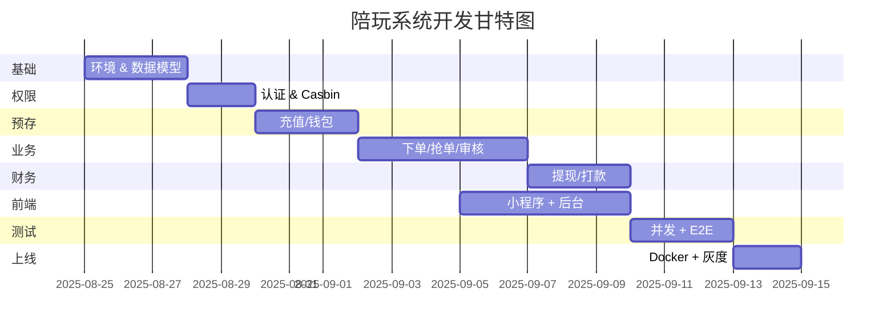

通用陪玩系统 V-FINAL  
「零坑」开发顺序表（含前端、后端、测试、上线 4 条线）  
格式：阶段 → 子任务 → 前置 → 人日 → 交付物

────────────────────────
🔧 阶段 1　基础设施（Day 1-2）
1-1　创建 Django 项目骨架　　　　　　—　　　0.5　manage.py + settings 分层  
1-2　Docker-Compose 环境　　　　　　—　　　0.5　docker-compose.yml  
1-3　PostgreSQL + Redis 容器　　　　—　　　0.5　.env 模板  
1-4　Vite + Vue3 + TS 脚手架　　　　—　　　0.5　vite.config.ts  

────────────────────────
🗂️ 阶段 2　数据层（Day 2-3）
2-1　BaseModel + 审计字段　　　　　　—　　　0.5　common/models.py  
2-2　用户/角色/权限表　　　　　　　　2-1　　0.5　identity/models.py  
2-3　钱包/充值/冻结表　　　　　　　　2-1　　0.5　wallet/models.py  
2-4　订单 & 子单 & 申诉表　　　　　　2-1　　0.5　business/models.py  
2-5　迁移脚本 & 假数据　　　　　　　　2-4　　0.5　001_full.sql + fixtures.json  

────────────────────────
🔐 阶段 3　权限 & 认证（Day 3-4）
3-1　JWT 登录/刷新　　　　　　　　　2-2　　0.5　identity/views.py  
3-2　Casbin 策略表 & 中间件　　　　　3-1　　0.5　identity/middleware.py  
3-3　按钮级权限装饰器　　　　　　　　3-2　　0.5　common/decorators.py  

────────────────────────
💰 阶段 4　预存域接口（Day 4-6）
4-1　充值单创建 + 回调　　　　　　　3-1　　1.0　POST /wallet/deposit/orders/  
4-2　钱包余额查询　　　　　　　　　　4-1　　0.5　GET  /wallet/  
4-3　冻结/解冻 Service　　　　　　　4-2　　0.5　wallet/services.py  
4-4　退款申请 + 审核　　　　　　　　4-3　　1.0　POST /wallet/refund/requests/  

────────────────────────
🛒 阶段 5　业务域接口（Day 6-10）
5-1　客服人工下单　　　　　　　　　4-3　　1.0　POST /orders/manual/  
5-2　客户自助下单　　　　　　　　　4-3　　1.0　POST /orders/self/  
5-3　抢单锁 + 子单生成　　　　　　　5-2　　1.0　POST /orders/{id}/pick/  
5-4　子单完成 + 审核　　　　　　　　5-3　　1.0　POST /suborders/{id}/audit/  
5-5　结算触发器（信号）　　　　　　5-4　　0.5　signals.py  

────────────────────────
💸 阶段 6　财务接口（Day 10-12）
6-1　提现申请创建　　　　　　　　　5-5　　0.5　POST /withdraw/requests/  
6-2　财务批量打款 CSV　　　　　　　6-1　　1.0　POST /withdraw/batch/  
6-3　银行回调解析　　　　　　　　　6-2　　0.5　utils/bank_parser.py  

────────────────────────
📱 阶段 7　前端小程序（Day 8-14，并行）
7-1　登录 + 路由守卫　　　　　　　3-3　　1.0　pinia/auth.ts  
7-2　充值页　　　　　　　　　　　　4-2　　1.0　views/WalletRecharge.vue  
7-3　抢单列表 + 实时推送　　　　　5-3　　2.0　views/OrderPool.vue  
7-4　客服审核页　　　　　　　　　　5-4　　1.0　views/CsAudit.vue  
7-5　店长污点大屏　　　　　　　　　5-4　　1.0　views/CaptainDashboard.vue  

────────────────────────
🧪 阶段 8　测试（Day 12-15）
8-1　并发抢单脚本　　　　　　　　　5-3　　1.0　tests/load/test_pick.py  
8-2　钱包并发扣款脚本　　　　　　　4-3　　1.0　tests/load/test_wallet.py  
8-3　端到端 Cypress　　　　　　　　7-5　　1.0　cypress/e2e/flow.cy.ts  

────────────────────────
🚀 阶段 9　部署 & 上线（Day 15-17）
9-1　Docker 镜像　　　　　　　　　全部　　0.5　Dockerfile  
9-2　Helm Chart　　　　　　　　　　9-1　　0.5　chart/  
9-3　Prometheus 规则　　　　　　　9-2　　0.5　prometheus.yml  
9-4　蓝绿灰度发布　　　　　　　　　9-3　　0.5　values-gray.yaml  

────────────────────────
⏱️ 甘特图（37 人日 ≈ 7.5 周）

复制即可开工！